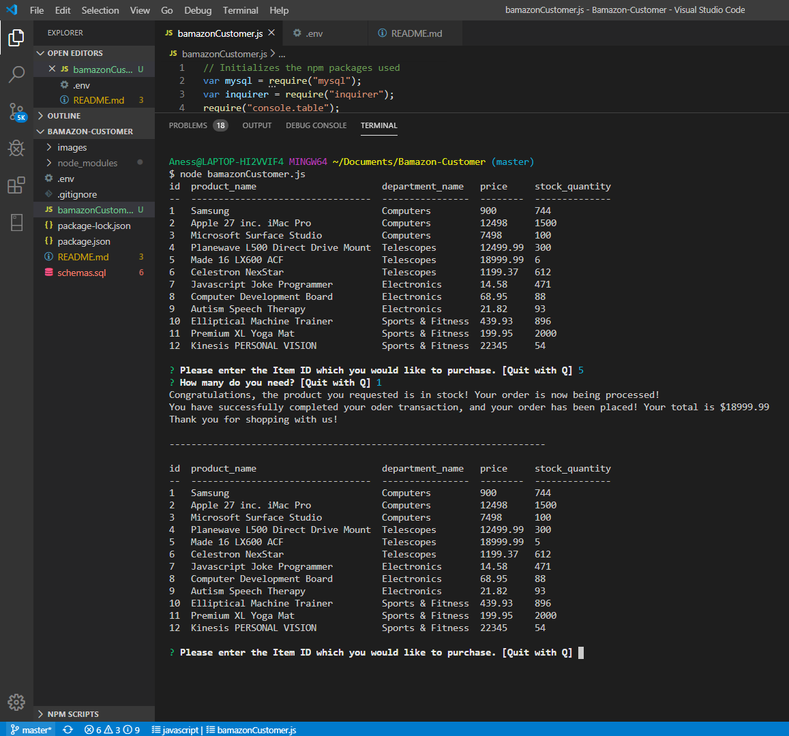
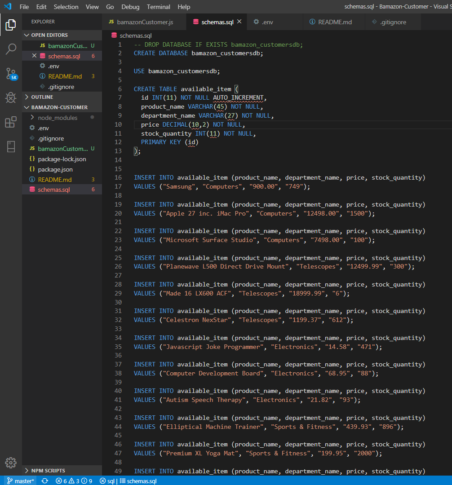
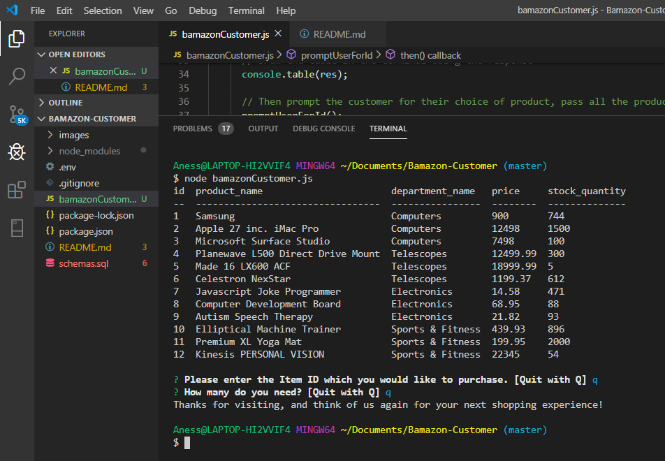

# Bamazon-Customer

Welcome to my replica of BamazonCustomer.js

This node.js backend application is intended for users to purchase an item from my very own Bamazon inventory items that's for sale, then once an item is purchased, the inventory will automatically update with one less of the item that was previously purchased.

To access my MySQL database located within my machine -- I utilized the npm "require" for the npm(node package manger) "mysql" to load the database.

NPM module "inquirer" to prompt users with questions and for then input answers and validating the answers and managing hierarchical prompts.

I created a "loadListedProducts()" function to load the "available_item" table from my MySQL -- interconnection with "connection.connect".
    Called the function "itemTooPurchase" within the above function so it can load once the connection is established.

In order to interconnect to my very own personal MySQL -- I created a "my.createConnection" utilizing four mysql connection options.
    host: aka "localhost" the database name I am connecting to.
    port: the port number to connect to.
    user: my MySQL authenticate.
    database: name of my unique database to interconnect to.

I created a "checkIfShouldExit()" method as an option for users to exit if they selected the wrong item_id or decided not to continue. Called "inquirer.prompt" for the process of asking the question...
    How many do you need.

Within the "itemTooPurchase" function, I used "inquirer.prompt" for the process of asking the question, input answers and validating the answers and managing hierarchical prompts.
Please enter the Item ID which you would like to purchase.
    Quit with Q.
    How many do you need.
interconnected the item to mysql database with the colum-name -- "item_id" and put input in-front "input.item_id" for it to be called that point on (identified item with my item_id).

Used "queryStr" to Query db to confirm that the given item ID exists in the desired quantity -- mysql ALL from my "available_item" table.

When I run the bamazonCustomer.js. application -- It  1st --- display all of the items available for sale. Include the ids, names, and prices of products for sale.

The app will then prompt users with two messages.

    1st should ask them the ID of the product they would like to buy.
    2nd message should ask how many units of the product they would like to buy.
Once the customer has placed the order, the app will check if the store has enough of the product to meet the customer's request.

If not, the app logs a phrase like Insufficient quantity!, and then prevents the order from going through.
However, if the store does have enough of the product, it fulfills the customer's order.

This means the SQL database updates to reflect the remaining quantity.
Once the update goes through, it shows the customer the total cost of their purchase.

